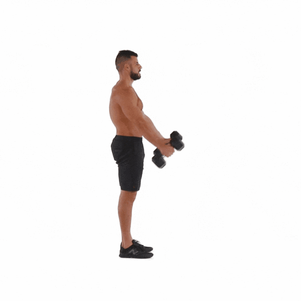
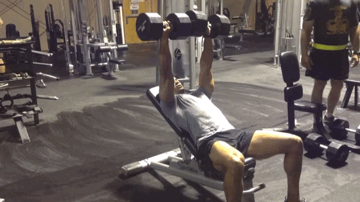
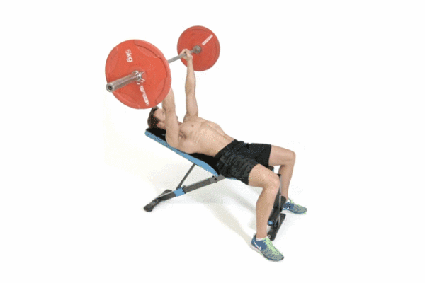
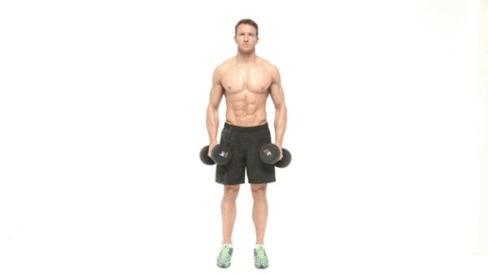
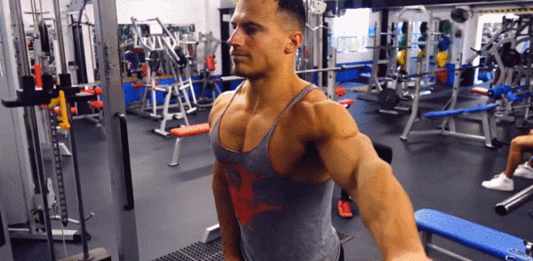
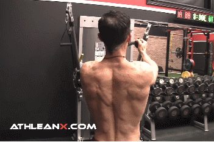
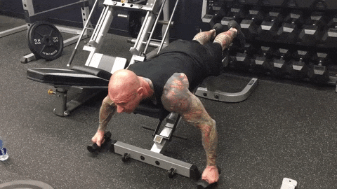
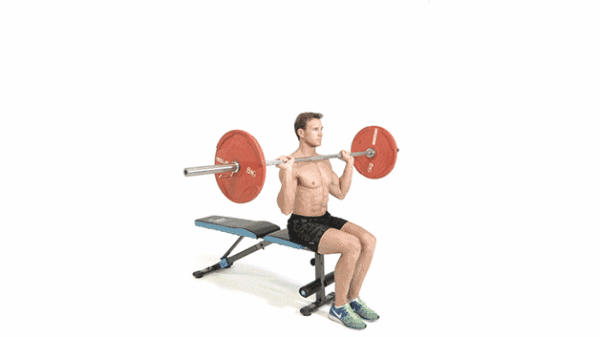
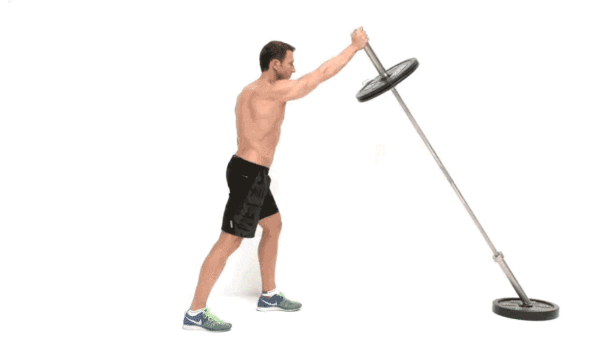

## 肩部肌肉应该怎么练？

#### 肩部肌肉的组成

Front Deltoid：三角肌前束
功能：屈曲(flexion) 、内收(adduction)、内旋(interal rotation)手臂/肩关节
Deltoid Medial： 三角肌中束
功能：手臂的外展(abduction)
Rear Deltoid： 三角肌后束
功能：伸展(extension)、外展(abduction)、外旋(external rotation)手臂/肩关节

#### 三角肌前束训练

#### 关键词：前平举

用前平举的方法来刺激三角肌前束，这包括经典的哑铃前平举，和衍生的使用杠铃片进行前平举

一些细节:
1. 启始：身体直立，哑铃垂在大腿前侧，手臂自然下垂。
2. 脑海里浮现出肩部的样子，用肩部发力将哑铃举起，忘掉自己的手臂， 上举时候身体不要晃，举至于地面平 （这不是玄学，脑子里想着发力位置的肌肉，真的很有用）
3. 在人生巅峰稍作停留，感受肩部的肌肉收缩，然后，还是用肩部控制放下的速度，慢慢讲其放下

#### 关键词：上斜卧推

>上斜卧推是一个非常好的上肢复合动作，可以非常有效的刺激胸肌和肩部.

#### 三角肌中束

#### 关键词：侧平举

##### 这块肌肉的核心作用仅有一样：手臂的外展

#### 哑铃侧平举

>注意：1.千万别耸肩！！！耸肩做这个动作刺激达不到最好不说，还有可能损伤你的颈部肌肉。2.不需要很大的重量。3.保持身体的稳定，别乱晃，肘部的位置不能低于手持哑铃的位置

比如单手持哑铃的，再比如绳索的，看你个人对哪个动作感受度好，没有最好的动作，只有最适合你的。

#### 三角肌后束
脸拉:

>脸拉的动作不是绝对的，不是一定要放在某一个高度才可以，只要你能感受到三角肌后束发力，挑一个对你感受度好的动作就行

>JEFF大叔脸拉

#### 谈谈练肩的复合动作
##### 杠铃肩上举
这个动作是一个非常好的复合动作，适合冲击较大重量，何况很轻易就可以代偿。 对很多没有什么基础的人，耐力会较差，对肌肉掌握不好，因此在孤立动作中上不了重量，所以，使用复合动作上大重量，是个非常好的选择。

如果需要更加孤立的刺激肩部，而不希望借力，可以采用坐姿

##### 单手撑撑撑（手动狗头）

这个复合动作对于肩部和上肢的爆发力提升非常有帮助，

建议的是快上慢下，可以在力所能及的范围内冲击一点重量。这个动作对增强核心也有非常大的好处

#### 肩部训练误区
1. 用的太重

 肩部训练误区用的太重肩关节是很灵过的，也是很脆弱的，因此肩膀很容易会因为大重量而受伤，提高感受度才是关键，不要一味上在肩上堆大重量

2.  绝对标准的动作

  绝对标准的动作每个人的肩膀结构都是不一样的，肩峰下空间大小也都不尽相同，因此一个对你来说角度太大的动作，可能对其他人来说正好，挑选适合自己的动作，如何判断是否适合自己？ 简单来说，在合理的条件下，这个动作感觉不疼，不别扭，这个是基础

#### 肩部拉伸